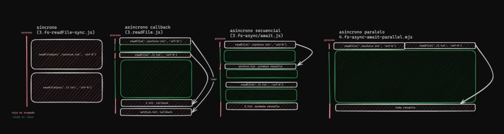

# Módulos Nativos en Node.JS

Los módulos nativos son aquellos que vienen integrados con Node.js
Y como Node.JS es un entorno de ejecución cuenta con muchos módulos para trabajar con el sistema operativo, archivos, rutas, internet, etc.

## Síncrono vs Asíncrono vs Paralelo

- Síncrono: El código se ejecuta línea a línea, y cada línea espera a que la anterior termine para ejecutarse, el hilo está siempre bloqueado.

- Asíncrono con callback: El hilo está bloqueado un instante mientras indica la operación a realizar y luego se libera hasta que termina y entonces se puede ejecutar el callback. Durante el tiempo que está liberado puede continuar haciendo cosillas hasta que el callback se pueda ejecutar.

- Asíncrono con await: Igual que el anterior, el hilo se libera pero durante la espera no puede hacer nada más, no puede continuar con la siguiente línea hasta que no termina la operación asíncrona. A nivel de recursos está libre pero a efectos prácticos como el caso síncrono.

- Paralelo: En este caso las dos lecturas se realizan estrictamente al mismo tiempo y cuando las dos están terminadas se ejecuta el callback. El hilo está libre hasta que se complete la operación.
