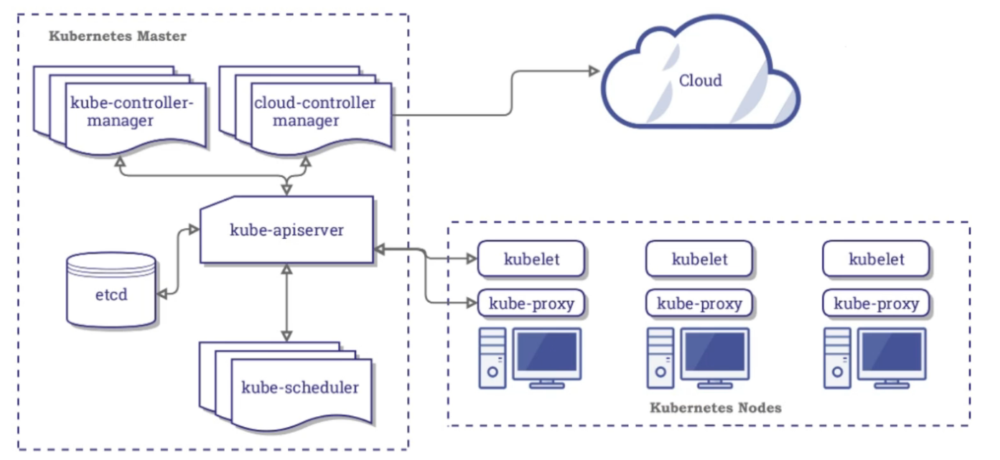

### Master
Es el capitán, controla a los nodos y los ordena, posee unos componentes pare realizar estas operaciones:

* API (KubeApiServer) - Puerta con la que un usuario (nosotros) podemos indicar a k8s nuestras necesidades, como nuevos despliegues y k8s decidirá en que nodo los aplica. 
Con la herramienta **kubectl** desde la línea de comandos podemos ordenar estas instrucciones.  

* KubeScheduler - Cuando la API recibe una petición, esta llama al Scheduler para saber en qué aplica nodo o que nodo es más óptimo.  
Si tenemos muchos nodos en un primer lugar solo valora los 15 primeros para ganar velocidad.  
Si no hay nodos disponibles para crear un contenedor, se quedará en pendiente y en cuanto haya disponibilidad se asignará a un nodo.  

* KubeController - Está compuesto por:
  * NodeController - Se encarga de mantener el número de nodos pedido, si muriera una, este NodeController crearía otra para reemplazar.
  * ReplicaController - Mantiene el número de réplicas requerido por cada despliegue.
  * EndpointController - Crear las redes internas para permitir conexiones.
  * ServiceAccount y TokenController - Cuando hacemos llamada a la API.   

* Etcd - Base de datos clave-valor donde el cluster almacena los datos de configuración, estados, backups...

### Nodos
Son máquinas virtuales o físicas donde el master ordena realizar acciones (despliegues, rollbacks, etc). Su funcionamiento es realizado por dos agentes:

* Kubelet - Agente que se encarga de recibir las peticiones del máster y enviar información al master.
Kubelet procesa la información recibida del master y trata de hacerla realidad a través del runtime de contenedores que esté instalado en cada nodo,
después devuelve el resultado al master. 

* KubeProxy - Agente que administra la red (networking) dentro de cada nodo y en relación con los contenedores.

* ContainerRuntime - Puede ser docker, RKT... al igual que los otros agentes tiene que estar presente en cada nodo.