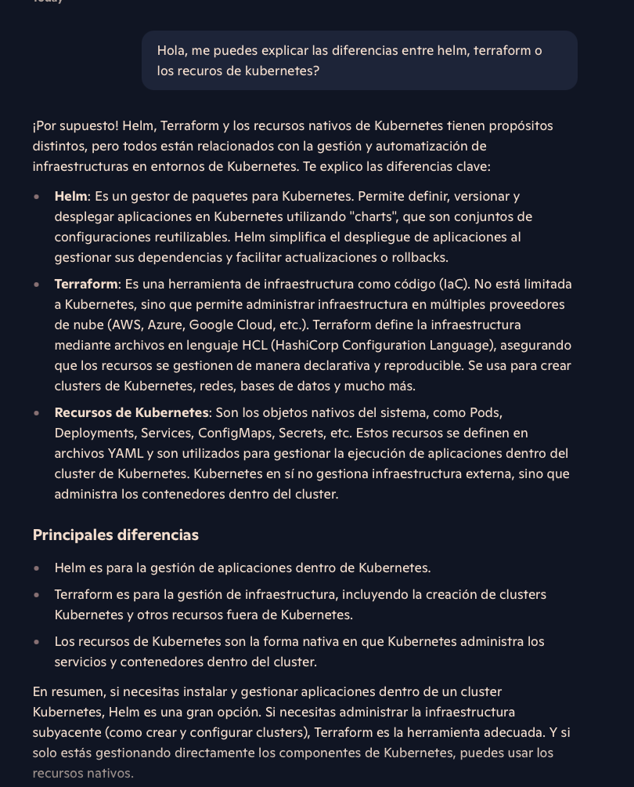

# Introducción a Terraform

Terraform, es una herramienta de infraestructura como código, nos permite desplegar infra en multiples cloud providers,
pero también en kubernetes (Es agnóstico al cloud provider).

## Infrastructure as Code IaC

### IaC orientado a la configuración
Instalar y gestionar software en servidores (aprovisionamiento de servidores)
Estandarización en todos los servers
Control de versiones para despliegues
- Ansible o Puppets

### IaC orientado a servidores (templates)
Nos permiten tener pre-instalado software y dependencias necesarias
Funcionan tanto para VMs como para contenedores
Infraestructura inmutable (se crea una nueva imagen con cada cambio necesario (no obligatorio pero buena práctica))
- Docker, Packer o Vagrant

### IaC para aprovisionamiento
Infraestructura como código declarativo (qué queremos no como)
Aprovisionar recursos inmutables para nuestra infraestructura
Toda clase de recursos como instancias, BDs, VPC...
Se puede desplegar en multiples cloud providers (terraform solo)
- Terraform o AWS CloudFormation

## HCL

